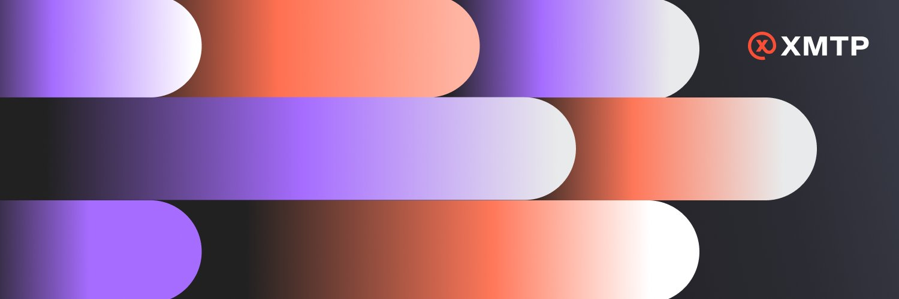

# XMTP Subgraphs



This repository contains subgraphs for event listening of XMTP smart contracts related to payer services. This indexed data can be consumed by apps, enabling real-time UI updates, historical data analysis, and overall enhanced user experience without directly querying raw blockchain data.

## Key Technologies

-   **[The Graph Protocol](https://thegraph.com/)**: Decentralized indexing protocol for organizing blockchain data.
-   **[Graph CLI](https://github.com/graphprotocol/graph-cli)**: Command-line interface for developing and deploying subgraphs.
-   **[AssemblyScript](https://www.assemblyscript.org/)**: A TypeScript-like language compiled to WebAssembly, used for writing subgraph mapping logic.
-   **[Alchemy Subgraphs](https://www.alchemy.com/subgraphs)**: Hosted service for subgraph deployment and querying.

## Repository Structure

This monorepo is organized into two primary subgraph projects, one for each target chain type (settlement chain and appchain):

```text
.
├── settlement-chain-contracts/ # Subgraph for Base
│   ├── abis/                   # Contract ABI files
│   ├── src/                    # AssemblyScript mapping handlers
│   ├── <environment>.yaml      # Subgraph manifest for a specific environment
│   ├── schema.graphql          # GraphQL schema for entities
│   ├── .env                    # API key and version label
│   └── package.json            # Build and deployment scripts
├── appchain-contracts/         # Subgraph for XMTP Appchain
│   ├── abis/
│   ├── src/
│   ├── <environment>.yaml
│   ├── schema.graphql
│   ├── .env
│   └── package.json
└── README.md
```

Each directory (`app-chain` and `settlement-chain`) contains a self-contained subgraph project, including its schema, ABIs, mapping logic, and scripts.

## Getting Started

### Prerequisites

-   Node.js
-   npm or Yarn (Yarn recommended for `workspaces`)

### Setup

1.  **Clone the repository:**

```bash
git clone https://github.com/xmtp/subgraphs.git
cd subgraphs
```

2.  **Install dependencies:**

In each project directory, run:

```bash
npm install
# or
yarn install
```

3.  **Configure Environment Variables:** Create a `.env` file in the relevant subgraph project (`settlement-chain-contracts` or `appchain-contracts`) and add your Alchemy deploy key and a version label:

```text
DEPLOY_KEY=YOUR_ALCHEMY_DEPLOY_KEY
VERSION_LABEL=v0.3.0
```

## Development Workflow

TODO

## Querying Data

Once your subgraphs are deployed and synced, you can query their data using GraphQL. Alchemy provides a dedicated GraphQL API endpoint for each deployed subgraph. You can find this endpoint on your subgraph's dashboard in the Alchemy UI.

## License

This project is licensed under the MIT License. See the LICENSE file for details.
